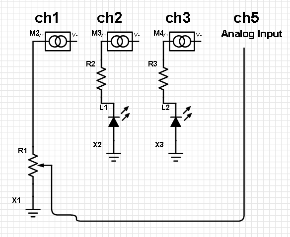
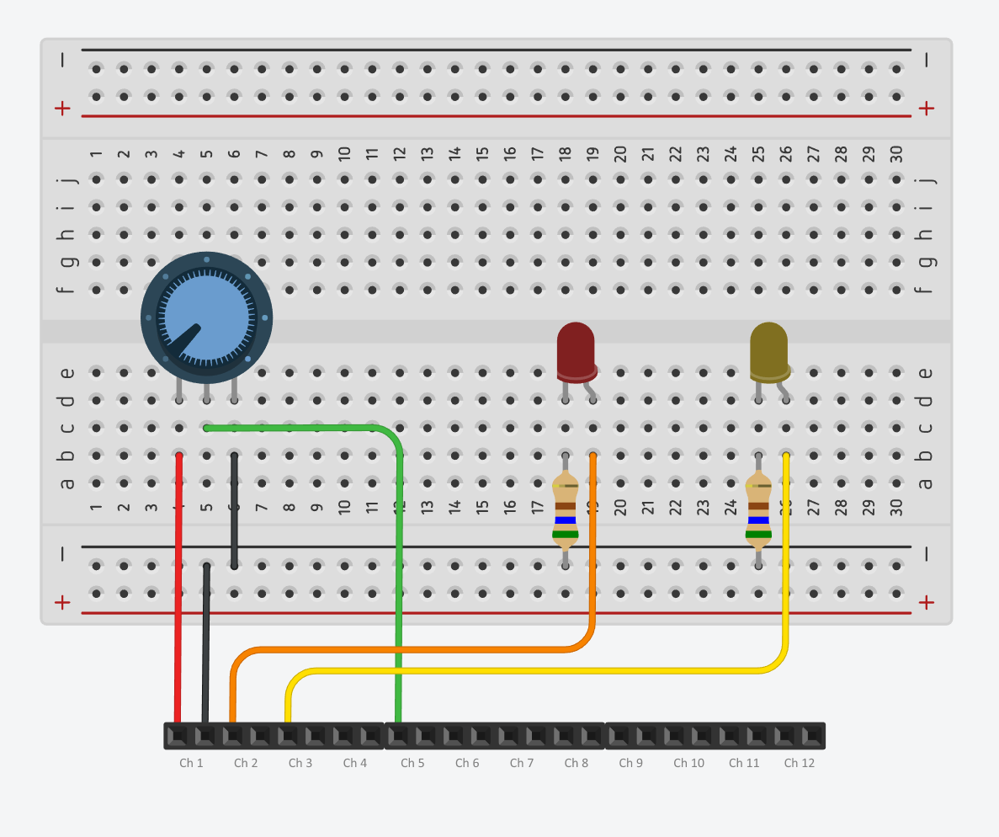

# Hardware Setup

## Equipment Used

**Hardware**                           | **Purpose**
-------------------------------------- | -----------
Powered ZumIQ-enabled ZumLink Z9-PE    | Radio with Linux Development Environment. This demonstration will use one radio for simplicity, but the Sensor and Client app can be run on separate radios if desired.
IOE-4422                               | [FreeWave I/O Expansion Serial Base](http://www.freewave.com/products/ioex/). Only the first five channels will be used, so n IOE-4404 or IOE-4440 could also be used.
12V Power Supply                       | FreeWave P/N: EMD1280UX. Used to power the Serial Base
USB Ethernet Adapter                   | Optional. Used to create a separate local network attached to a computer.
RJ45 to DB9 Null Modem Cable           | FreeWave P/N: ECD2408ED. Used with "Rainbow" data cable to connect IOE-44XX to Z9-P/PE.
"Rainbow" Data Cable (ASC3610DJ)       | FreeWave P/N: ASC3610DJ. Used to connect IOE-4422 with DB9 serial cable
USB-to-DB9 Serial cable                | FreeWave P/N: ECC2409US. Used with "Rainbow" cable to configure IOE-4422 using Tool Suite
Breadboard                             | For circuit prototyping.
10K Potentiometer                      | Used to vary voltage to simulate tank level.
LEDs (x2)                              | For indicating when tank level exceeds thresholds.
560Ω 0.5W resistors (2x)               | To reduce current across LEDs.
Jumper Wires                           | For wiring everything together.

## Serial Base Setup

While the Serial Base can be configured using Modbus directly (See the [IO Expansion User Manual and Reference Guide](http://support.freewave.com/knowledge-base/io-expansion-module-user-manual/)), generally it is easier to use 
[Tool Suite](http://www.freewave.com/tool-suite-programming-configuration-monitoring/).

This document will only cover the procedure at a high level. For detailed information on using Tool Suite to configure the Serial Base, see the documentation at the links above.

### Basic Procedure

1. Connect your computer to the Serial Base using an USB-to-Serial cable connected to the "Rainbow" data cable.
2. Power the Serial Base.
3. Launch Tool Suite.
4. Select the "Configuration" tool.
5. Select "Add Network", give it a name, and click "Next".
6. Ensure that "Network Type" is "Serial", and click "Finish".
7. Select the COM port associated with the USB-to-Serial cable, then select "Read Serial Base".
8. Select the Universal Channels tab, and configure channels 1,2, and 3 as follows:

#### Channel 1

This channel provides power to the potentiometer.

**Setting**          | **Value**
-------------------- | ---------
I/O Mode             | Sensor Power
Apply Default Output | Yes
Default Output       | On

#### Channel 2 and 3

These channels provide power to the LEDs.

**Setting**          | **Value**
-------------------- | ---------
I/O Mode             | Sensor Power
Apply Default Output | Yes
Default Output       | Off

9. Select the Input-Only Channels tab, and configure channel 5 as follows:

#### Chanel 5

This channel is used to monitor the output voltage from the potentiometer.

**Setting**        | **Value** 
------------------ | --------- 
I/O Mode           | Analog Input
Voltage or Current | Voltage
Zero Voltage       | 0
Voltage Span       | 12000
Resistor Pull      | Pull-up
Filtering          | None
Integer Type       | Unsigned

10. Select the Stack Settings tab, and configure as follows:

#### Stack Settings

These settings affect communication with all channels.

**Setting**                     | **Value**
------------------------------- | --------- 
Serial Protocol                 | RS-232
Port Speed                      | 19200
Parity                          | None
Stop Bits                       | 1 bit
Modbus Address Mode             | 8 bit
Modbus ID:                      | 1
Modbus Message Interval         | 2
AI Integer Result Justification | Left
Floating Point word Order       | Regular
Long Integer Word Order         | Regular
Default Delay                   | 60
Power Mode                      | Regular

11. Click the "Program All" button to the upper-right of the tabs.
12. Disconnect the "Rainbow" cable from the USB-to-Serial cable and connect it to the RJ45-to-Serial cable, as described in [Hardware Setup](hardware-setup.md).

### Verifying Configuration

Once configured with Tool Suite, power cycle the Serial Base. With a multimeter, test Channel 1 to ensure that it's providing 12V, and test Channels 2 and 3 to verify that they are providing 0V.

## Wiring Setup

Next, set up the components on a breadboard and connect them to the channels on the Serial Base. The following circuit schematic and breadboard layout diagrams show the desired configuration.

* Channel 1 provides power and ground to the potentiometer. 
* The center pin of the potentiometer is connected to Channel 5, which reads the voltage value
* The two LEDs are connected to Channel 2 and 3, using current-limiting resistors.

**NOTE:** When configured as "Sensor Power", a channel will output the same voltage as supplied to the Serial Base, in this case 12V, necessitating the current-limiting resistors.

## Next Steps

See [Software Prerequisites](software-prerequisites.md) to get the Z9-PE configured with Mosquitto and other dependencies.

